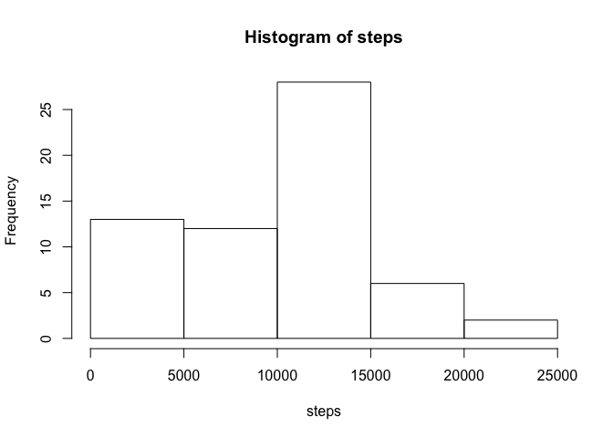
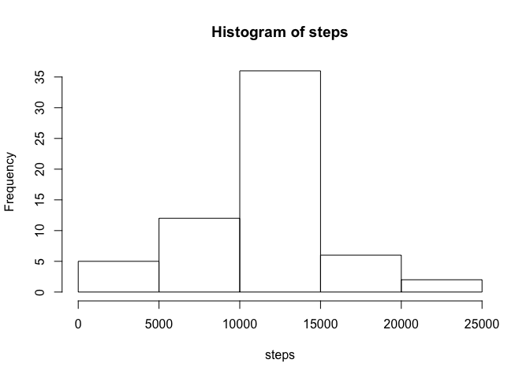
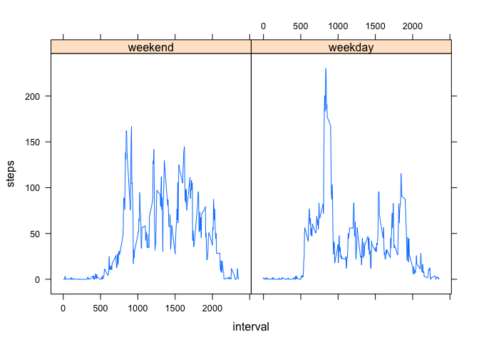

# Reproducible Research: Peer Assessment 1
Wouter van Amsterdam  


## Loading and preprocessing the data


```r
library(data.table)
activity <- fread("activity.csv")
```


## What is mean total number of steps taken per day?


```r
library(data.table)
library(dplyr)
act_day <- activity[, list(steps = sum(steps, na.rm = T)), by = "date"]
act_day[, mean(steps)]
```

```
## [1] 9354.23
```

```r
invisible(act_day[, hist(steps)]) # suppress histogram details
```

<!-- -->

```r
act_day[, list(mean_steps = mean(steps), median_steps = median(steps))]
```

```
##    mean_steps median_steps
## 1:    9354.23        10395
```


## What is the average daily activity pattern?


```r
act_interval <- activity[, list(steps = mean(steps, na.rm = T)), by = "interval"]
act_interval[, plot(steps~interval, type = 'l')]
```

<!-- -->

```
## NULL
```

```r
act_interval[steps == max(steps), list(interval, steps)]
```

```
##    interval    steps
## 1:      835 206.1698
```


## Imputing missing values


Look at missing values. Create copy of data.table. 
Impute values based on average value for that interval

```r
colSums(is.na(activity))
```

```
##    steps     date interval 
##     2304        0        0
```

```r
act_imp <- copy(activity)
act_imp[is.na(steps), steps:=act_interval[interval == interval, steps]]
```

```
## Warning in `[.data.table`(act_imp, is.na(steps), `:=`(steps,
## act_interval[interval == : Coerced 'double' RHS to 'integer' to match
## the column's type; may have truncated precision. Either change the target
## column to 'double' first (by creating a new 'double' vector length 17568
## (nrows of entire table) and assign that; i.e. 'replace' column), or coerce
## RHS to 'integer' (e.g. 1L, NA_[real|integer]_, as.*, etc) to make your
## intent clear and for speed. Or, set the column type correctly up front when
## you create the table and stick to it, please.
```

```
##        steps       date interval
##     1:     1 2012-10-01        0
##     2:     0 2012-10-01        5
##     3:     0 2012-10-01       10
##     4:     0 2012-10-01       15
##     5:     0 2012-10-01       20
##    ---                          
## 17564:     4 2012-11-30     2335
## 17565:     3 2012-11-30     2340
## 17566:     0 2012-11-30     2345
## 17567:     0 2012-11-30     2350
## 17568:     1 2012-11-30     2355
```

```r
colSums(is.na(act_imp))
```

```
##    steps     date interval 
##        0        0        0
```


Based on inputed data, create histogram again and median and mean values. The histogram changed clearly. 

```r
act_imp_day <- act_imp[, list(steps = sum(steps)), by = 'date']
invisible(act_imp_day[, hist(steps)])
```

<!-- -->

```r
act_imp_day[, list(mean_steps = mean(steps), median_steps = median(steps))]
```

```
##    mean_steps median_steps
## 1:   10749.77        10641
```

Mean increased by 
1396 
steps, quite dramatic. The median only increased by 
246 
steps, which is better.


## Are there differences in activity patterns between weekdays and weekends?


```r
act_imp[, weekend:=factor(weekdays(lubridate::ymd(date)) %in% c("Saturday", "Sunday"), levels = c(T,F), labels = c("weekend", "weekday"))]
```

```
##        steps       date interval weekend
##     1:     1 2012-10-01        0 weekday
##     2:     0 2012-10-01        5 weekday
##     3:     0 2012-10-01       10 weekday
##     4:     0 2012-10-01       15 weekday
##     5:     0 2012-10-01       20 weekday
##    ---                                  
## 17564:     4 2012-11-30     2335 weekday
## 17565:     3 2012-11-30     2340 weekday
## 17566:     0 2012-11-30     2345 weekday
## 17567:     0 2012-11-30     2350 weekday
## 17568:     1 2012-11-30     2355 weekday
```

```r
act_imp[, table(weekend)]
```

```
## weekend
## weekend weekday 
##    4608   12960
```

```r
act_imp_weekend <- act_imp[, list(steps = mean(steps)), by = 'weekend,interval']

library(lattice)
xyplot(steps ~ interval | weekend, data = act_imp_weekend, type = 'l')
```

<!-- -->

From the look of it, this guy walks to work, or to a coffee shop each workday.


